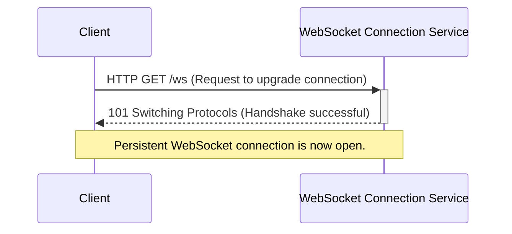
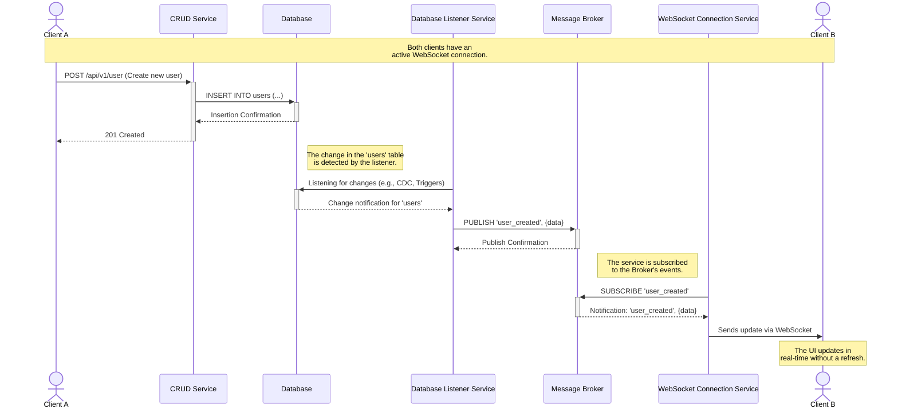

# Real-Time Sync Hub

A multi-service application designed to demonstrate real-time data synchronization between clients using a decoupled, event-driven architecture.

## Tech Stack

*   **Backend:** Deno, TypeScript
*   **Database:** PostgreSQL
*   **Messaging:** Kafka, WebSocket
*   **Containerization:** Docker, Docker Compose

## Getting Started

### Prerequisites

*   Docker and Docker Compose
*   Git

### Installation & Setup

1.  Clone the repository and its submodules:
    ```bash
    git clone --recurse-submodules https://github.com/juannpz/realtime-sync-hub.git
    ```

2.  Navigate to the project directory:
    ```bash
    cd realtime-sync-hub
    ```

3.  **Configure Environment Variables**

    Each service requires a `.env` file in its respective directory to function correctly. Create the files as described below.

    **A) CRUD Service (`./services/crud-service/.env`)**

    | Variable              | Description                                  | Example Value          |
    | :------------         | :------------------------------------------- | :--------------------- |
    | `DB_HOST`             | Hostname of the PostgreSQL database.         | `postgres`             |
    | `DB_PORT`             | Port of the PostgreSQL database.             | `5432`                 |
    | `DB_NAME`             | Name of the database to connect to.          | `postgres`             |
    | `DB_USER`             | Username for the database connection.        | `postgres`             |
    | `DB_PASSWORD`         | Password for the database user.              | `your_secret_password` |
    | `JWT_KEY`             | Secret key used for signing JSON Web Tokens. | `your_jwt_secret`      |

    **B) Database Listener Service (`./services/database-listener-service/.env`)**

    | Variable            | Description                               | Example Value          |
    | :------------------ | :---------------------------------------- | :--------------------- |
    | `DB_HOST`           | Hostname of the PostgreSQL database.      | `postgres`             |
    | `DB_PORT`           | Port of the PostgreSQL database.          | `5432`                 |
    | `DB_NAME`           | Name of the database to connect to.       | `postgres`             |
    | `DB_USER`           | Username for the database connection.     | `postgres`             |
    | `DB_PASSWORD`       | Password for the database user.           | `your_secret_password` |
    | `BROKER_HOST`       | Hostname of the Kafka message broker.     | `kafka`                |
    | `BROKER_PORT`       | Port of the Kafka message broker.         | `9092`                 |
    | `BROKER_CLIENT_ID`  | Unique ID for this service's Kafka client.| `db-listener-client`   |

    **C) WebSocket Connection Service (`./services/websocket-connection-service/.env`)**

    | Variable              | Description                                     | Example Value            |
    | :-------------------- | :---------------------------------------------- | :----------------------- |
    | `DB_HOST`             | Hostname of the PostgreSQL database.            | `postgres`               |
    | `DB_PORT`             | Port of the PostgreSQL database.                | `5432`                   |
    | `DB_NAME`             | Name of the database to connect to.             | `postgres`               |
    | `DB_USER`             | Username for the database connection.           | `postgres`               |
    | `DB_PASSWORD`         | Password for the database user.                 | `your_secret_password`   |
    | `WS_PORT`             | Port for this WebSocket server to listen on.    | `5001`                   |
    | `BROKER_HOST`         | Hostname of the Kafka message broker.           | `kafka`                  |
    | `BROKER_PORT`         | Port of the Kafka message broker.               | `9092`                   |
    | `BROKER_CLIENT_ID`    | Unique ID for this service's Kafka client.      | `websocket-client`       |
    | `SESSION_SERVICE_URL` | URL of the internal session management service. | `http://session-service:3000` |

4.  Start all services using Docker Compose. This will build the images and run the containers in detached mode.
    ```bash
    docker-compose up --build -d
    ```

## Running the Services

Once the `docker-compose up` command is complete, the services will be running and available at their respective ports as defined in `docker-compose.yml`.

*   **CRUD Service API:** `http://localhost:8000`
*   **WebSocket Service:** `ws://localhost:8080`

You can view the logs for all services by running:
```bash
docker-compose logs -f
```

To stop the services, run:
```bash
docker-compose down
```

## Running Tests

To run the tests for a specific service, navigate to its directory and execute the Deno test command.

```bash
# Example for crud-service
cd services/crud-service
deno test --allow-all
```
Repeat for any other service as needed.

---

## System Architecture: Real-Time Update Flow

This section describes the architecture and data flow of the real-time synchronization system. The process is best understood in two distinct phases: the initial connection and the subsequent data update flow.

### A. Initial WebSocket Connection Flow

Before any real-time updates can be received, each client must establish a persistent connection with the `WebSocket Connection Service`. This process, known as a "handshake," looks like this: [Show render](https://newmo-oss.github.io/mermaid-viewer/?sequence-number=0#eJxlkDFvwlAMhHd+xY1UNC2sGbJQVKYqaiIxvz7cYJHa6bND/j6CRAjBZtnn705n9N+TRPrg0KTwNwOALiTnyF0Qx7plEkewaXoS7Oin0ngkryidONJFetthrSIUnVUw3WdXwgjLimLx+J9jW9clPjc13gfD/PsS0Byu6LsmhT0h3qAvV9gjIsuKIhsdcqyWK1QDezywNCiTukZtDfNtkL0dwpFgfYxk9tu3I+9LnaAnSlPM1yeHHCUlY3O6b+AuGNggOkA7krczg6B7fA==)



### B. Real-Time Data Update Flow

Once the connection is established, the system is ready to push updates. The components below work together to propagate a change from one user to another in real-time.

#### Core Components

1.  **CRUD Service (`crud-service`):** A REST API responsible for all Create, Read, Update, and Delete (CRUD) operations on the database. It is the entry point for any data modification.
2.  **Database Listener Service (`database-listener-service`):** A service that monitors the database for changes (inserts, updates, deletes). Upon detecting a change, it publishes a notification to a specific channel on the message broker.
3.  **WebSocket Connection Service (`websocket-connection-service`):** Manages persistent WebSocket connections with clients. It subscribes to notifications from the message broker and relays the change data to the corresponding clients through their WebSocket connection.

#### Sequence Diagram

The following diagram shows how a change made by `Client A` propagates through the system to `Client B`. [Show render](https://newmo-oss.github.io/mermaid-viewer/?sequence-number=0#eJx1k0GP2jAQhe/7K94NqkLo9hhVSJuwUiNt2RUB9Vg5ziSxNtjUdrKqqv73CjuQQOAWT97Me/40NvS7IclpJVip2f4BABi3SiOuBUn7BGa6Tzy5vwemreDiwKRFvNmtUtKt4OR0m90K3XmkXTHLMmac8PQ9FkUvwliSpIcynIv3hkdavfueH2QMK6mrjIQ/KUsVfyc7iH2uIVZSErdCyQunIZBoACR6cL/XyhJUS2dms5M2RKRsBe5OBhVrCUx+y/RiybgVLQ28+dk78GO7YfPl8vOAc4i313SLBTuIRfu4aAxpTGNNzBIkfeBY+OT7+6bjjBPMEMk6fd5skay3r05uMA2CwDedVPP5cjm/sE2kIe3QxEoWQu/Z8TBycn0+eYivXx7hs+UDVFqUlYUq0EfaVgReMVkShIStCBOXbALLspocMWGQkyVuKUf2x4nqbi86Yv32XF7YV4UsUSjd+RhMKSiDGeJVPMNWi7IkbW5A6IeGiH1EqawoBHcA3Mgu7K0Ufg9DvO2ilyT97qW/uIcymeFvziz75xq9dGT61mS1MNUl9p5mTYWDeb3ZHqrp1lwYmCYzXIuMcofTKofQm04MqD3uaEfyetjwJukuSuNNEj1f3eX6DuNA6wG38B6Je/7nJ5WSzA2aQ35c+VawXnzzNUYexC7pWgyEf4GaWD23Yk/4ELZSjQWDpkKTqYL/y9+unQ==)



#### Detailed Update Flow

The sequence diagram is explained by the following steps:

1.  **Data Modification:** **Client A** performs an action that modifies data by sending an HTTP request (e.g., `POST /api/v1/user`) to the **CRUD Service**.

2.  **Database Operation:** The **CRUD Service** processes the request and executes the corresponding operation in the **Database**.

3.  **Change Detection:** The **Database Listener Service**, which is constantly monitoring the database, detects the change instantly.

4.  **Notification Publishing:** The **Database Listener Service** publishes a message with details of the change to a specific channel on the **Message Broker**.

5.  **Subscription and Reception:** The **WebSocket Connection Service**, which is subscribed to that channel, receives the message from the broker.

6.  **Relaying to the Client:** The **WebSocket Connection Service** identifies which connected clients should receive this update and sends the data to **Client B** (and any other relevant clients) through their active WebSocket connection.

7.  **UI Update:** **Client B**'s application receives the data and dynamically updates the user interface in real-time.

### Conclusion

This decoupled architecture allows the system to be robust and scalable. Each service has a single responsibility, which simplifies maintenance and independent development. The use of a message broker as an intermediary ensures that the services are not directly dependent on each other, allowing notifications to be processed asynchronously and reliably.
